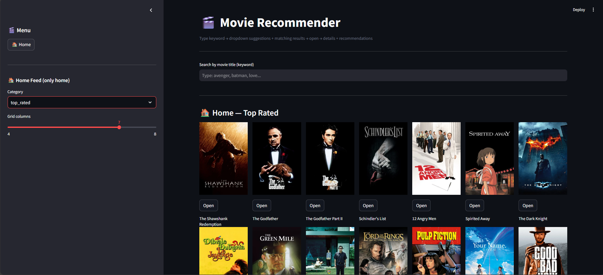
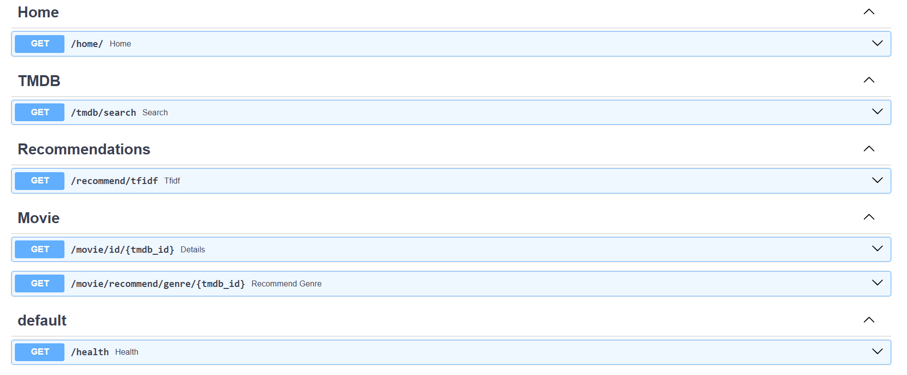
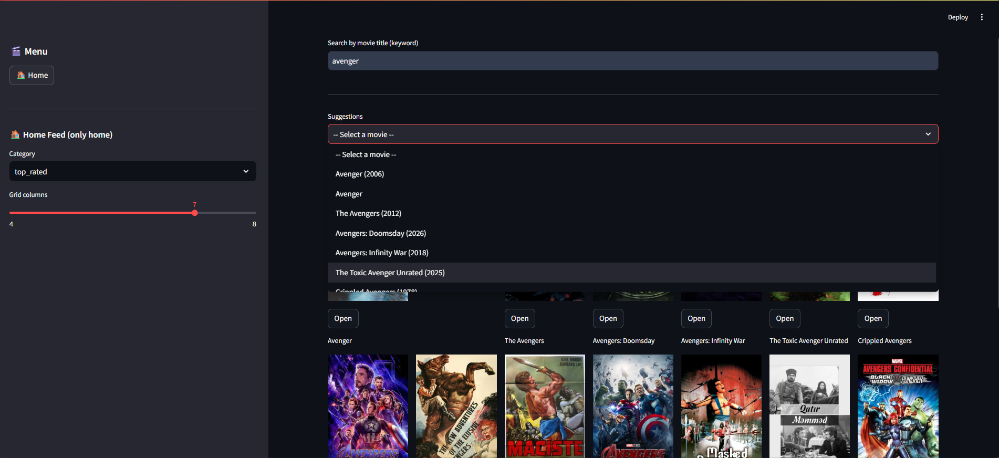
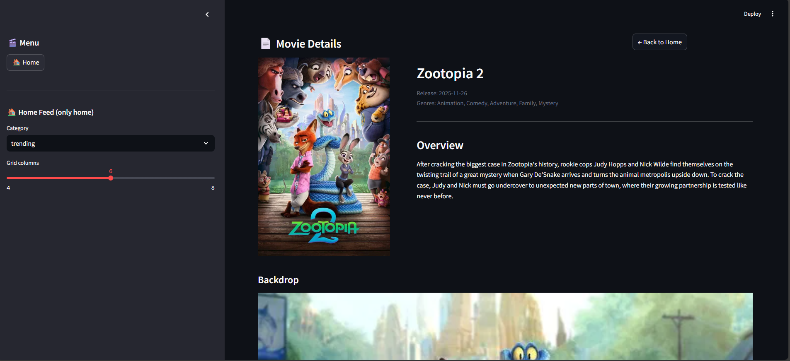

Here’s a professional, production-ready `README.md` file for your GitHub repository. It highlights your architecture, APIs, training process, and UI — perfect for showcasing your full-stack movie recommender system.

---

# 🎬 Movie Recommendation System

> A full-stack, production-grade movie recommendation engine built with FastAPI (backend), Streamlit (frontend), and scikit-learn (ML). Trained using TF-IDF and genre-based similarity on TMDB data.

  


---

## 📁 Project Structure

```
movie-recommender/
├── core/               # Core config & startup
├── img/                # Static images
├── models/             # Model training scripts & pickles
├── pickle_files/       # Serialized models & dataframes
├── routes/             # FastAPI route modules
├── services/           # Business logic & API clients
├── venv/               # Virtual environment
├── .env                # Environment variables
├── .gitignore
├── app.py              # FastAPI main entrypoint
├── main.py             # Streamlit frontend entrypoint
├── movies_metadata.csv # Raw dataset
├── Movies.ipynb        # Training notebook (Jupyter)
├── requirements.txt    # Dependencies
└── README.md           # You are here!
```

---

## ⚙️ Backend: FastAPI Endpoints

Your backend exposes clean, well-documented RESTful APIs:


### 🏠 Home Feed
```http
GET /home/
```
Returns trending/popular movies based on category.

---

### 🔍 TMDB Search
```http
GET /tmdb/search?query={keyword}
```
Searches TMDB database by movie title keyword.

---

### 🎯 Recommendations
```http
GET /recommend/tfidf
```
Returns TF-IDF based recommendations (content-based).

---

### 🎥 Movie Details
```http
GET /movie/id/{tmdb_id}
```
Fetches detailed metadata for a specific movie.

---

### 🎭 Genre-Based Recommendations
```http
GET /movie/recommend/genre/{tmdb_id}
```
Recommends similar movies based on genre similarity.

---

### 🩺 Health Check
```http
GET /health
```
Returns service status (for deployment monitoring).

> ✅ All endpoints are documented via Swagger UI at `/docs` when running locally.

  

---


## 🧠 Model Training

The recommendation engine was trained in `Movies.ipynb` using real TMDB data:

- **Data**: `movies_metadata.csv` (cleaned and preprocessed).
- **Techniques**:
  - TF-IDF vectorization on movie overviews.
  - Cosine similarity for content-based recommendations.
  - Genre-based filtering for hybrid suggestions.
- **Output**: Pickle files saved in `pickle_files/`:
  - `df.pkl` — Processed DataFrame
  - `tfidf_matrix.pkl` — TF-IDF matrix
  - `tfidf.pkl` — Fitted TF-IDF vectorizer
  - `indices.pkl` — Title-to-index mapping

> 📦 Models are loaded at runtime for fast inference — no retraining needed.

---

## 🖥️ Frontend: Streamlit UI

Built with modern, responsive design:

- **Home Screen**: Browse trending/popular movies with grid layout.
- **Search**: Real-time suggestions + poster grid results.
- **Details Page**: Movie info + genre-based recommendations.
- **Navigation**: Clean routing with query params (`?view=details&id=123`).

📸 *Screenshots !*  

 

 

---

## 🚀 How to Run Locally

### 1. Clone the repo
```bash
git clone https://github.com/yourusername/movie-recommender.git
cd movie-recommender
```

### 2. Set up virtual environment
```bash
python -m venv venv
source venv/bin/activate  # Linux/Mac
# venv\Scripts\activate   # Windows
```

### 3. Install dependencies
```bash
pip install -r requirements.txt
```

### 4. Set environment variables
Create `.env` file:
```env
API_BASE_URL=http://127.0.0.1:8000
TMDB_API_KEY=your_tmdb_key_here
```

> 💡 Get your free [TMDB API Key](https://www.themoviedb.org/settings/api)

### 5. Start FastAPI backend
```bash
uvicorn app:app --reload
```
→ Access API docs at: `http://localhost:8000/docs`

### 6. Start Streamlit frontend
In another terminal:
```bash
streamlit run main.py
```
→ Open browser at: `http://localhost:8501`

---

## 📦 Deployment Ready

This project is structured for easy deployment:

- **Backend**: Deploy FastAPI on Render, Railway, or AWS.
- **Frontend**: Host Streamlit on Streamlit Community Cloud or Render.
- **Environment**: Uses `.env` for secrets/configs.
- **Health Check**: `/health` endpoint for uptime monitoring.

---

## 📈 Future Improvements

- Add collaborative filtering (user ratings).
- Implement caching (Redis) for faster recommendations.
- Add user profiles and history.
- Integrate with Firebase/Auth for login.
- Dockerize for containerized deployment.

---

## 🤝 Contributing

Feel free to fork, submit issues, or open pull requests!  
All contributions welcome 🙌

---

## 📄 License

MIT License — see [LICENSE](LICENSE) for details.

---

## 👨‍💻 Author

[Abdullah Al Alif] — [AbdullahAlAlif](https://github.com/AbdullahAlAlif)  
📧 alif126426@example.com

---

✅ *This README is ready to be pushed to GitHub. Just replace placeholder image links with your actual screenshots, and fill in your name/contact info.*

Let me know if you want a `CONTRIBUTING.md`, `LICENSE`, or `docker-compose.yml` next!
